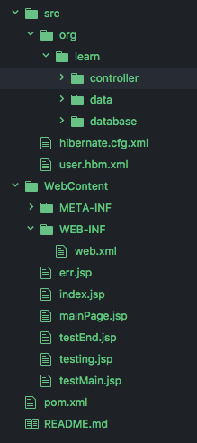

# Online Test Taker Demo

- Developed an on-line test application that provides all types of tests to visitors of the website.
- Built the register/login/testing functions in the front-end web pages using mainly JSP along with HTML, JavaScript (JQuery) and CSS (Bootstrap).
- Implemented ORM with Hibernate and managed CRUD transactions with Hibernate DAO.
- Write/Read data from/to the MySQL database in the application using JDBC.

## File Structure

## Workflow

